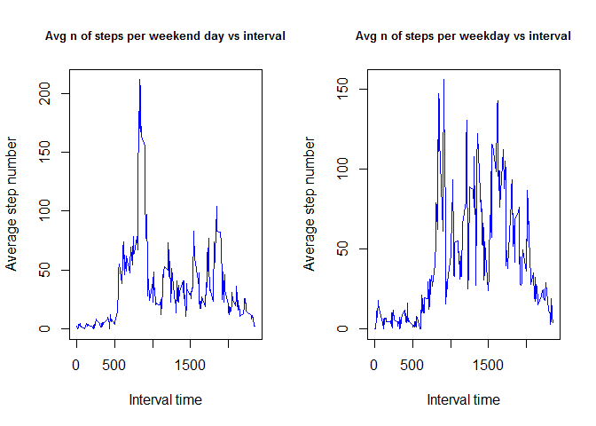

Data processing
---------------

Data is processed below. A function to add zeros to the interval column
has been created in order to convert the date + interval columns to
posXIct. Also, where steps data is not available, rows have been
removed.

    df <- read.csv("activity.csv")
    #add zeros so that times like "340" can be converted to posIXct
    add_zeros <- function(x){
            if (nchar(x)<4){
                    for (i in 1:(4-nchar(x))) {
                        x <- paste('0',x, sep = '')    
                    }
            }
            x
    }
    df$dt <- as.POSIXct(paste(df$date, sapply(df$interval,add_zeros))
                        , format="%Y-%m-%d %H%M")
    df$date_posix <- as.POSIXct(df$date,  format="%Y-%m-%d")

    #print shape of dataframe
    print(dim(df))

    ## [1] 17568     5

Including Plots
---------------

What is the mean total number of steps taken per day?
-----------------------------------------------------

1.  Calculate the number of steps per day

<!-- -->

    df_2 <- tbl_df(df)
    df_grouped <- group_by(df_2,date)
    df_summarized <- summarize(df_grouped, nsteps = sum(steps))

1.  Make a histogram of the total steps taken per day

<!-- -->

    hist(df_summarized$nsteps, col = "blue", xlab = "Number of steps per day"
         , ylab = "Times occurred", main = "Number of steps per day histogram")

 3.
Calculate and report the mean and median of the total number of steps
per day

    steps_mean = mean(df_summarized$nsteps, na.rm = TRUE)
    steps_median = median(df_summarized$nsteps, na.rm = TRUE)

The mean is 10766.2 steps per day and the median is  
10765 steps per day.

What is the average daily activity pattern?
-------------------------------------------

1.  Make a time series plot of the 5 minute interval (x axis) vs the
    average number of steps taken across all days (y axis)

<!-- -->

    df_2 <- tbl_df(df)
    df_grouped <- group_by(df_2,interval)
    df_summarized <- summarize(df_grouped, nsteps = sum(steps,na.rm = TRUE))
    plot(df_summarized$interval, df_summarized$nsteps, type ='l')

 2.
Which 5 minute interval, on average across all days in the dataset,
contains the maximum number of steps?

    maximum_interval <- tail(arrange(df_summarized, nsteps),1)[1,"interval"][[1]]

The interval that contains the maximum number of steps as average is 835
to 840

Imputing missing values
-----------------------

1.  Calculate and report the number of missing values in the dataset

<!-- -->

    n_missing_values <- dim(df_2[is.na(df_2$steps),])[1]

The number of missing values is 2304.

1.  Devise a strategy for filling in all of the missing values in the
    dataset.

The missing data can be inputted as the average for that interval and
that day of the week

1.  Create a new dataset that is equal to the original dataset but with
    the missing data filled in

<!-- -->

    df_2$weekdays <- weekdays(df_2$date_posix)
    df_grouped_weekday_interval <-  group_by(df_2[!is.na(df$steps),]
                                             ,.dots = c("weekdays","interval")) 
    df_2_summarised <- summarise(df_grouped_weekday_interval
                                 , avgsteps = mean(steps))
    df_2_null_data <- df_2[is.na(df_2$steps),c("weekdays","interval")]
    df_2_null_steps <- merge(df_2_null_data, df_2_summarised
                            , by = c("weekdays","interval"))$avgsteps
    df_2[is.na(df_2$steps),"steps"] = df_2_null_steps

1.  Make a histogram of the total number of steps taken each day and
    Calculate and report the mean and median total number of steps taken
    per day. Do these values differ from the estimates from the first
    part of the assignment? What is the impact of imputing missing data
    on the estimates of the total daily number of steps?

<!-- -->

    df_grouped <- group_by(df_2,date)
    df_summarized <- summarize(df_grouped, nsteps = sum(steps))
    hist(df_summarized$nsteps, col = "blue", xlab = "Number of steps per day"
         , ylab = "Times occurred", main = "Number of steps per day histogram")

    steps_mean_2 = mean(df_summarized$nsteps)
    steps_median_2 = median(df_summarized$nsteps)
    mean_diff <- steps_mean_2 - steps_mean
    median_diff <- steps_median_2 - steps_median

After missing values are imputed the mean is 10821.2 steps per day and
the median is 11015 steps. This means the mean is increasing by
55.0209226 per day whereas the median is increasing by 250.

Panel plot
----------

1.  Create a new factor variable in the dataset with two levels -
    "weekday" and "weekend" indicating whether a given date is a weekday
    or weekend day.

<!-- -->

    weekdays1 <- c('Saturday','Sunday')
    #Use `%in%` and `weekdays` to create a logical vector
    #convert to `factor` and specify the `levels/labels`
    df_2$weekend <- factor((df_2$weekdays %in% weekdays1),levels=c(FALSE, TRUE)
                           , labels=c('weekday','weekends'))
    head(df_2)

    ## # A tibble: 6 x 7
    ##   steps date     interval dt                  date_posix          weekdays
    ##   <dbl> <fct>       <int> <dttm>              <dttm>              <chr>   
    ## 1     0 2012-10~        0 2012-10-01 00:00:00 2012-10-01 00:00:00 Monday  
    ## 2     0 2012-10~        5 2012-10-01 00:05:00 2012-10-01 00:00:00 Monday  
    ## 3     0 2012-10~       10 2012-10-01 00:10:00 2012-10-01 00:00:00 Monday  
    ## 4     0 2012-10~       15 2012-10-01 00:15:00 2012-10-01 00:00:00 Monday  
    ## 5     0 2012-10~       20 2012-10-01 00:20:00 2012-10-01 00:00:00 Monday  
    ## 6     0 2012-10~       25 2012-10-01 00:25:00 2012-10-01 00:00:00 Monday  
    ## # ... with 1 more variable: weekend <fct>

1.  Make a panel plot containing a time series plot of the 5-minute
    interval (x-axis) and the average number of steps taken, averaged
    across all weekday days or weekend days (y-axis).

<!-- -->

    par(mfrow=c(1,2))

    df_grouped <- group_by(df_2[df_2$weekend == "weekday",],interval)
    df_summarized <- summarize(df_grouped, nsteps = mean(steps))
    plot(df_summarized$interval
         , df_summarized$nsteps, type = 'l' , col = "blue", xlab = "Interval time"
         , ylab = "Average step number"
         , main = "Avg n of steps per weekend day vs interval"
         , cex.main = 0.8)

    df_grouped <- group_by(df_2[df_2$weekend == "weekends",],interval)
    df_summarized <- summarize(df_grouped, nsteps = mean(steps))
    plot(df_summarized$interval
         , df_summarized$nsteps, type = 'l' , col = "blue", xlab = "Interval time"
         , ylab = "Average step number"
         , main = "Avg n of steps per weekday vs interval"
         , cex.main = 0.8)

